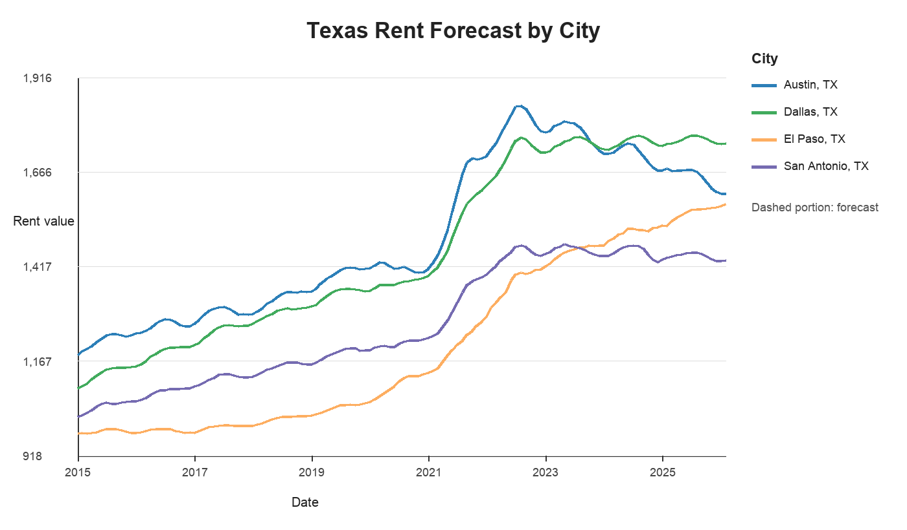
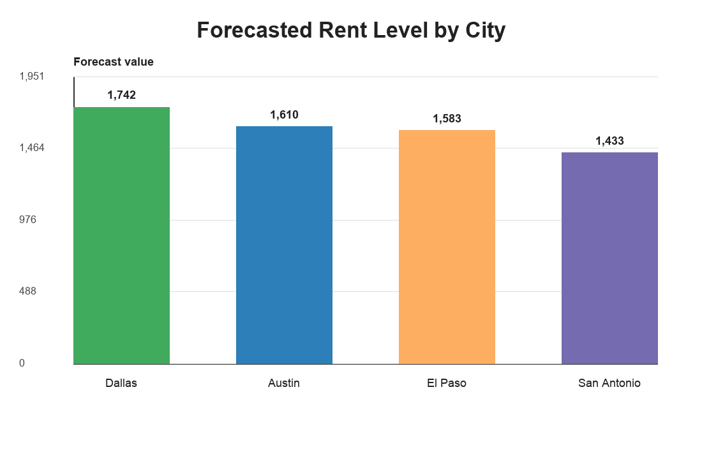
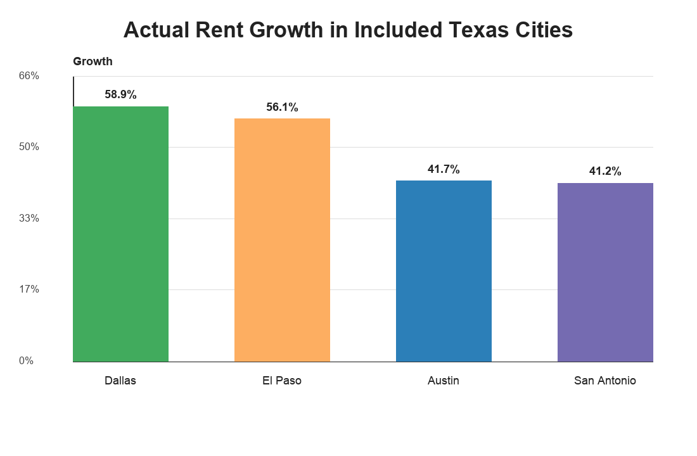

# Texas Cost of Living Forecast 2025

This project forecasts rent trends across selected Texas cities to support budgeting, relocation, planning, and reporting decisions.

It demonstrates a practical analyst workflow: working with public rent-index data, preparing forecast outputs, comparing cities, and communicating results with simple visuals.

## Business Problem

Cost-of-living changes affect relocation decisions, workforce planning, budgeting, and program operations. A city-level forecast can help analysts and decision-makers compare expected rent pressure across markets and plan for future affordability changes.

## Data Sources

- `Data/Raw/ZORI_AllHomesPlusMultifamily_SSA.csv` - Zillow Observed Rent Index style source file for all homes plus multifamily rentals
- `Data/Cleaned/forecast_output.csv` - cleaned actual and forecast output used for the README visuals

The committed forecast output currently includes four Texas cities:

- Austin, TX
- Dallas, TX
- El Paso, TX
- San Antonio, TX

## Tools Used

- Python
- pandas
- Pillow
- Jupyter Notebook
- Forecast output generated from the existing notebook workflow
- Git/GitHub

## Methods

1. Load rent-index data.
2. Reshape city-level time series from wide format to long format.
3. Prepare actual and forecast records by city.
4. Compare city-level trends across the included Texas markets.
5. Generate recruiter-friendly visuals from the cleaned forecast output.

## Key Findings

These findings are based on `Data/Cleaned/forecast_output.csv`.

- The actual data covers January 2015 through February 2025.
- The forecast period covers March 2025 through February 2026.
- Dallas has the highest final forecast value in the included output, at about 1,742.
- San Antonio has the lowest final forecast value in the included output, at about 1,433.
- Dallas and El Paso show the largest actual growth from the first included month to the latest actual month, at about 58.9% and 56.1%.

## Visuals

### Forecast Trend



### Final Forecast City Comparison



### Actual Rent Growth Comparison



## Repository Structure

- `Data/Raw/` - raw rent-index source file
- `Data/Cleaned/forecast_output.csv` - cleaned actual and forecast output
- `Notebooks/01_data_collection.ipynb` - original notebook workflow
- `scripts/generate_readme_visuals.py` - generates README visuals from the cleaned forecast output
- `images/` - generated PNG visuals
- `requirements.txt` - dependencies for regenerating the README visuals

## How to Run

```bash
git clone https://github.com/Juan-R1/cost-of-living-forecast-2025.git
cd cost-of-living-forecast-2025

python3 -m venv venv
source venv/bin/activate
pip install -r requirements.txt

python scripts/generate_readme_visuals.py
```

## Notebook Status

The notebook includes an exploratory forecasting workflow, but it was not treated as fully reproducible in this cleanup pass because it references lowercase `../data/...` paths while the repository uses `Data/...`, and it includes an inline `!pip install prophet` cell. The current README visuals are generated from the committed cleaned forecast output instead.

## Limitations

- The current forecast output includes four Texas cities; Houston is not included in `forecast_output.csv`.
- Forecast values should be interpreted as portfolio analysis output, not as financial advice.
- The notebook needs path cleanup and dependency cleanup before it can be considered fully reproducible.
- The `Dashboard/` folder does not currently include a committed dashboard screenshot or published dashboard export.

## Next Steps

- Clean the notebook paths so it can run from a fresh clone.
- Move notebook dependencies into a dedicated requirements file, including Prophet if the forecast model is retained.
- Add Houston if the forecast workflow is expanded to five Texas cities.
- Add a dashboard export or Tableau/Power BI screenshot if a dashboard is built.
- Add a short business memo explaining how the forecast could support workforce, relocation, or program planning.

## Resume Bullet

Built a Texas rent forecasting portfolio project using Python and public rent-index data to prepare city-level forecast outputs, compare rent trends, and communicate planning insights through recruiter-friendly visuals.

## LinkedIn Project Blurb

I built a cost-of-living forecasting project focused on selected Texas cities. The project uses public rent-index data and a cleaned forecast output to compare city-level trends, generate visual summaries, and show how forecasting can support budgeting, relocation, and operations planning.
